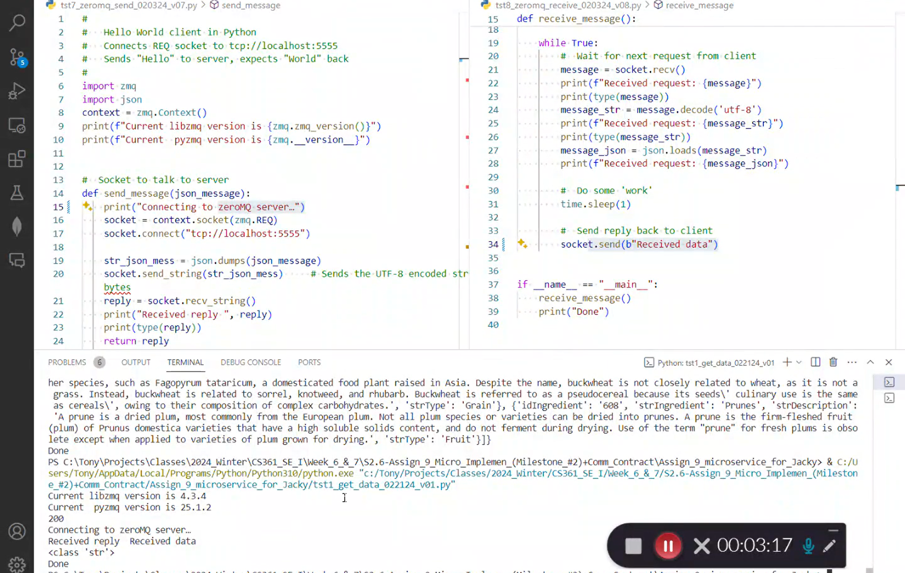
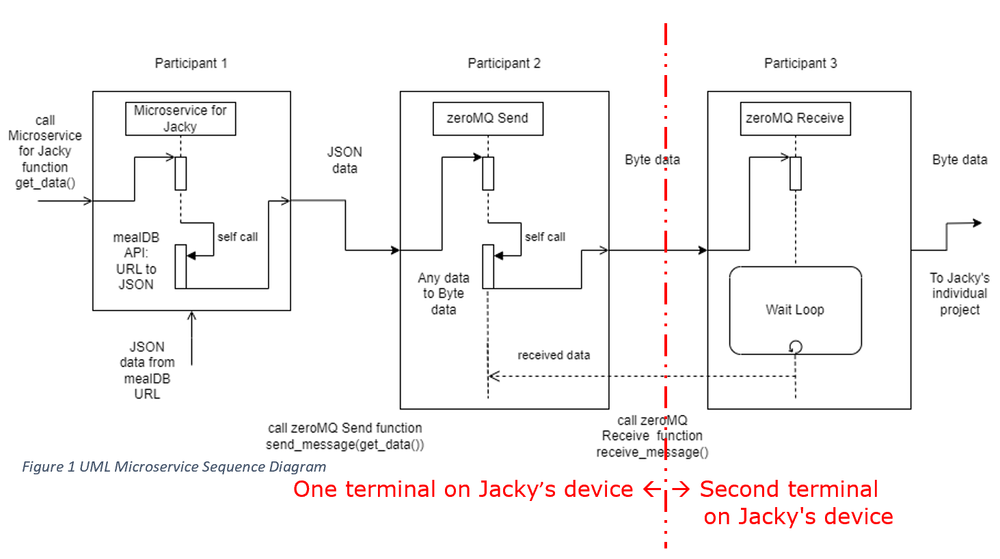

# Academic project completed in Winter 2024

## Recipe Fetcher Microservice (Server) — `recipe-fetcher-themealdb`

**Ingredient List Provider for Meal Search Client**  
This Python-based microservice fetches ingredient data from TheMealDB API and returns it as a JSON response through ZeroMQ messaging. It was built to serve as the data provider for a partner’s recipe lookup client microservice.

This repository contains my independent copy of a collaborative academic project completed as part of the
Computer Science program.

---

## Overview

This microservice acts as a backend API proxy that:

- Retrieves a list of ingredients from TheMealDB API.
- Sends the fetched data over ZeroMQ in JSON format.
- Supports a partner's microservice client that allows users to input an ingredient and receive a list of related recipes.

This was developed as part of a collaborative microservice system demonstrating asynchronous messaging and distributed microservice design using Python and ZeroMQ.

## Collaborators

This project was originally developed in collaboration with teammate Jacky K, and myself. This repo is
personalized, independently maintained version created for portfolio and resume.

---

## Technologies Used

- **Python 3**
- **Requests** (`requests`)
- **ZeroMQ** (`pyzmq`)

(Installed via `requirements.txt`)

---

## Features

- Connects to public **TheMealDB** API to fetch ingredients
- Handles network errors and timeouts gracefully
- Sends data via **ZeroMQ REP socket**
- Modular and testable Python structure

---

## How to Run the Microservice System

This project demonstrates a microservice architecture using three independent Python programs communicating over **ZeroMQ** sockets. Each component runs in a separate terminal window to simulate real-world service separation.

### 1. Install Requirements

Install dependencies using:

```bash
pip install -r requirements.txt
```

### 2. Start the Receiver (Terminal 1)

This program listens for JSON ingredient data on port `5555` using a ZeroMQ REP socket.

```bash
python tst8_zeromq_receive_020324_v08.py
```

### 3. Start the Ingredient Fetcher Microservice (Terminal 2)

This microservice fetches ingredient data from TheMealDB API and sends it via ZeroMQ using the `send_message()` helper.

```bash
python recipe_data_server.py
```

### 4. (Optional) Run the Test Client Sender (Terminal 3)

You may use this optional test client to send example JSON manually for testing ZeroMQ communication.

```bash
python tst7_zeromq_send_020324_v07.py
```

---

## File Structure

The repository contains the following files:

**A. Root Directory:**

- `recipe_data_server.py`  
  ‣ Main server application that fetches ingredient data from TheMealDB API and sends it over ZeroMQ.

- `tst7_zeromq_send_020324_v07.py`  
  ‣ Test client script that sends JSON data via ZeroMQ REQ socket.

- `tst8_zeromq_receive_020324_v08.py`  
  ‣ ZeroMQ receiver that listens for incoming data on port 5555.

- `requirements.txt`  
  ‣ Dependency list for the microservice components.

- `README.md`  
  ‣ Project overview, instructions, and demo explanation.

**B. `docs/` Directory:**

  - screenshots/                        # Interface and result screenshots (for README and report)
  - *.pdf                               # Report or design documents

---

## Communication Protocol

- **Messaging System**: ZeroMQ
- **Socket Type**: REQ/REP
- **Data Format**: JSON
- **API Source**: [https://www.themealdb.com/api/json/v1/1/list.php?i=list](https://www.themealdb.com/api/json/v1/1/list.php?i=list)

### Example JSON Response

```json
{
  "meals": [
    {
      "idIngredient": "1",
      "strIngredient": "Chicken",
      "strDescription": "Chicken is a versatile protein...",
      "strType": null
    },
  ]
}
```

---

## Screenshots and Demos

- **Screenshots**:  

The following screenshots are available in the `/docs/screenshots/` directory to illustrate key stages of the microservice system:

1. **ThemealDB API Test (Without ZeroMQ):**  
   Console output showing a standalone test of `recipe_data_server.py` fetching ingredient data directly from TheMealDB API without any socket communication.  
   

2. **ThemealDB API with ZeroMQ Pipeline:**  
   Terminal views of `recipe_data_server.py` sending JSON data through a ZeroMQ REQ socket and `tst8_zeromq_receive_*.py` receiving the data via REP socket, confirming end-to-end delivery.  
   

3. **System Architecture Diagram (UML):**  
   A UML-style diagram illustrating how the three components—`tst7_*.py`, `recipe_data_server.py`, and `tst8_*.py`—communicate using ZeroMQ sockets in a decoupled microservice setup.  
   

- **Demo Video**:  
A demonstration video is included to show the system in action, running across three terminal windows:

- **Terminal 1** runs the listener program (`tst8_zeromq_receive_020324_v08.py`)
- **Terminal 2** runs the ingredient-fetching microservice (`recipe_data_server.py`)
- **Terminal 3** (optional) runs a separate client sender (`tst7_zeromq_send_020324_v07.py`)

Demo Video: [Watch on YouTube](https://youtu.be/nDXo_aGHGJY)

> 🧩 **Note:** This video and the supporting programs are designed to mimic a real-world microservice integration — where the data provider (`recipe_data_server.py`) is physically or logically separated from the client and uses a message-based protocol (ZeroMQ) to communicate between services.

---

## License

This project is for demonstration and educational purposes. No affiliation with TheMealDB.
